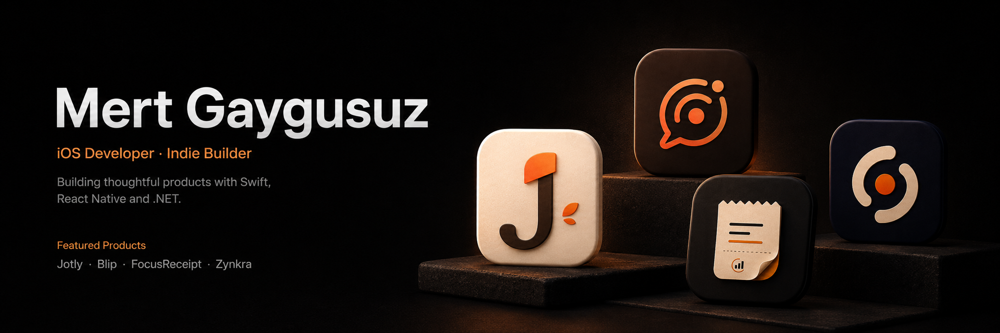
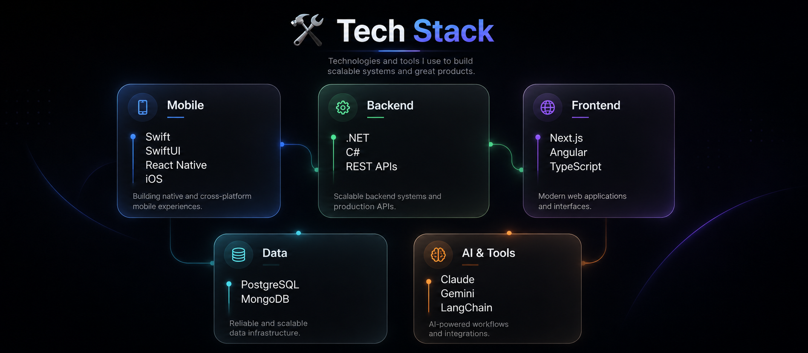
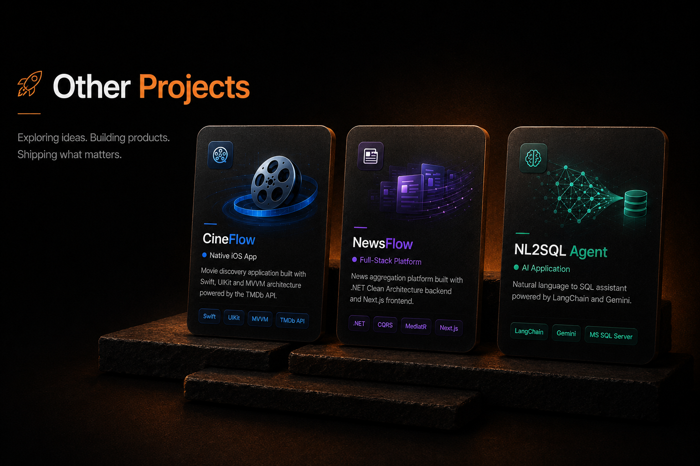

# 📱 Published iOS Apps

## FocusReceipt — Productivity Tracker

Minimal productivity app that transforms daily activities into receipt-style focus summaries with daily, weekly, and monthly insights.

`SwiftUI` · `SwiftData` · `WidgetKit` · `CloudKit` · `StoreKit`

 
 

---

## Jotly — Personal Thought Journal

Warm and minimal iOS journal designed for capturing thoughts, notes, tasks, and reflections in a calm personal flow.

`SwiftUI` · `SwiftData` · `MVVM` · `Local-first`

 
 

---

# 🛠 Tech Stack

 

# 🚀 Other Projects

