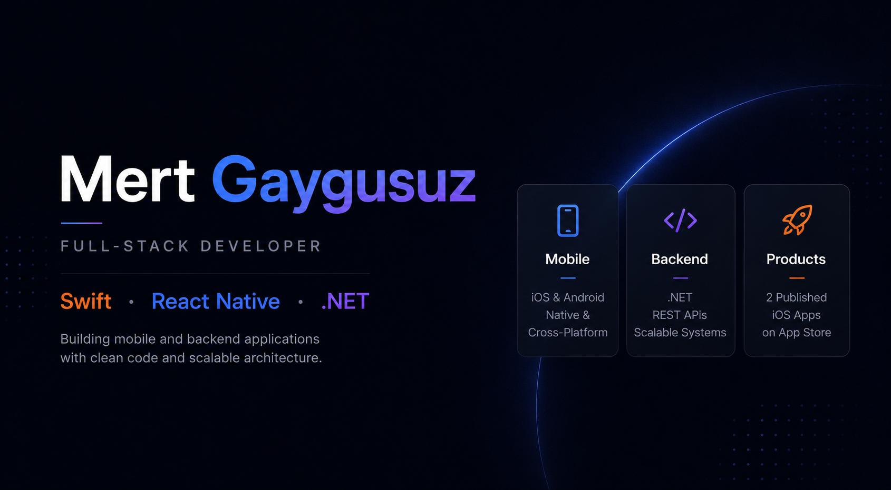
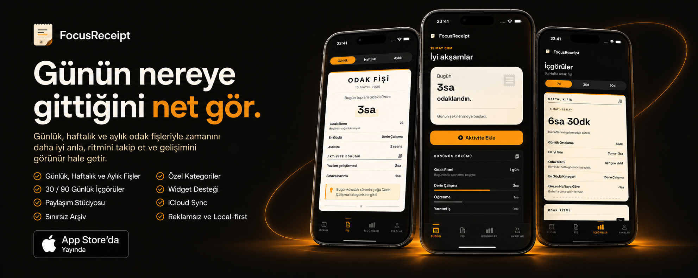
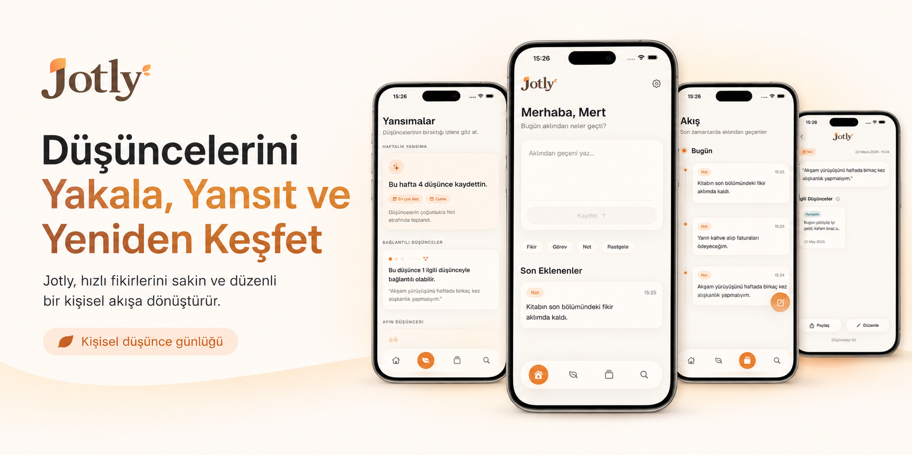

# 📱 Published iOS Apps

## FocusReceipt — Productivity Tracker

Minimal productivity app that transforms daily activities into receipt-style focus summaries with daily, weekly, and monthly insights.

`SwiftUI` · `SwiftData` · `WidgetKit` · `CloudKit` · `StoreKit`

 
 

---

## Jotly — Personal Thought Journal

Warm and minimal iOS journal designed for capturing thoughts, notes, tasks, and reflections in a calm personal flow.

`SwiftUI` · `SwiftData` · `MVVM` · `Local-first`

 
 

## 🛠 Tech Stack

### Mobile

### Back-End

### Front-End

### Databases

### AI & Tools

 

# 🚀 Other Projects

### [CineFlow](https://github.com/mertgaygusuz/CineFlow)

Native iOS movie discovery app built with **Swift/UIKit** and **MVVM architecture**, powered by the TMDb API.

### [NewsFlow](https://github.com/mertgaygusuz/NewsFlow)

Full-stack news aggregation platform with **.NET 10 Clean Architecture (CQRS/MediatR)** backend and **Next.js 15** frontend.

### [NL2SQL Agent](https://github.com/mertgaygusuz/nl2sql-agent)

AI assistant that converts natural language into MS SQL Server queries using **LangChain** & **Google Gemini 2.5 Flash**.

Features dual-chain architecture and an in-memory schema cache (Turbo Mode) that cuts response time by 80%.

 

